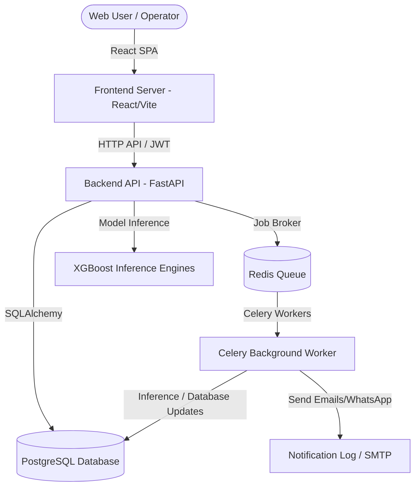
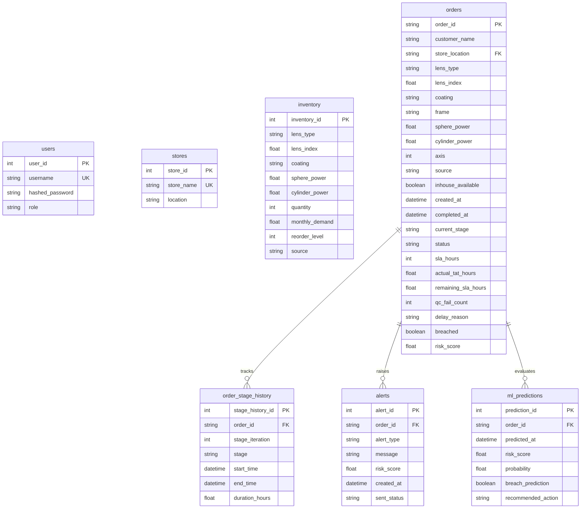

# System Architecture - AI Eyewear Order Management System

This document describes the technical architecture, data model, machine learning design, background job scheduler, and deployment blueprint.

---

## 1. System Overview

The system utilizes a modern full-stack web architecture to manage eyewear orders and optimize lens supply chains.

---

## 2. Entity-Relationship (ER) Diagram

The PostgreSQL database maintains consistency across orders, history logs, stock levels, ML predictions, and security roles.

---

## 3. Machine Learning Pipelines

The system embeds two distinct machine learning models implemented in XGBoost:

### A. Turnaround Time (TAT) Breach Classifier
- **Objective**: Predicts if an active order will exceed its lens-specific SLA.
- **Model**: `XGBoostClassifier` saved in `models/tat_model.pkl`.
- **Target**: `breached` (boolean).
- **Features**:
  1. `lens_type` (Categorical One-Hot)
  2. `lens_index` (Numerical)
  3. `coating` (Categorical One-Hot)
  4. `store_location` (Categorical One-Hot)
  5. `source` (Categorical One-Hot)
  6. `current_stage` (Categorical One-Hot)
  7. `remaining_sla_hours` (Numerical)
  8. `qc_fail_count` (Numerical)
  9. `risk_score` (Numerical - dynamic database baseline)

### B. Inventory Demand Forecast Regressor
- **Objective**: Forecasts monthly demand for specific lens parameters to optimize replenishment levels.
- **Model**: `XGBoostRegressor` saved in `models/inventory_model.pkl`.
- **Target**: `monthly_demand` (numerical).
- **Features**:
  1. `lens_type` (Categorical One-Hot)
  2. `lens_index` (Numerical)
  3. `coating` (Categorical One-Hot)
  4. `sphere_power` (Numerical)
  5. `cylinder_power` (Numerical)
  6. `source` (Categorical One-Hot)

---

## 4. API Endpoints

The API is fully documented with Swagger:

- **/api/auth/login** [POST]: Exchange credentials for a JWT.
- **/api/orders** [GET/POST]: List and filter orders or create a new order.
- **/api/orders/{id}** [GET/PATCH/DELETE]: Access, edit, or remove order details.
- **/api/orders/{id}/status** [POST]: Update the current stage or log QC loop failures.
- **/api/inventory** [GET]: Retrieve current catalog stock quantities.
- **/api/inventory/check** [POST]: Sourcing check tool matching lens criteria.
- **/api/predict** [POST]: Trigger ML prediction on an order.
- **/api/alerts** [GET]: View active breach warnings.
- **/api/send-alert** [POST]: Manually dispatch an alert.
- **/api/dashboard** [GET]: Aggregate KPIs and Recharts analytics.
- **/api/analytics** [GET]: Retrieve heatmaps and CSV-ready report data.

---

## 5. Celery Background Job Queue

Redis serves as the broker for background task orchestration:

1. **predict_risky_orders** (Every 10 mins): Runs XGBoost TAT model scoring across active orders.
2. **generate_alerts** (Every hour): Reviews risk scores and generates alerts for records > 80% breach risk.
3. **send_notifications** (Triggered): Sends SMTP emails and Twilio WhatsApp notifications.
4. **recalculate_inventory** (Every midnight): Re-evaluates monthly demand using the regressor.

---

## 6. Deployment Architecture

The application runs containerized using Docker Compose:

- **frontend**: Vite static React bundle served on port `3000`.
- **backend**: FastAPI application running with uvicorn on port `8000`.
- **postgres**: Database engine storing persistent tables.
- **redis**: Job queue broker and caching server.
- **celery_worker**: Workers running background inference, database queries, and notifications.
- **celery_beat**: Scheduler trigger for beat crons.
